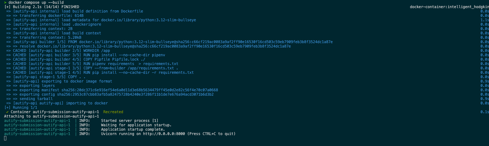
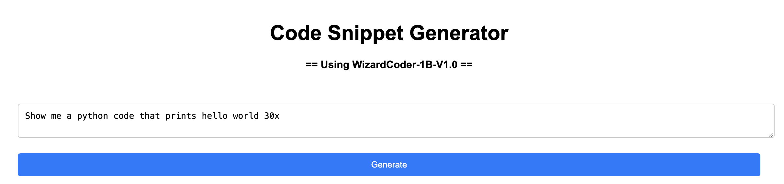
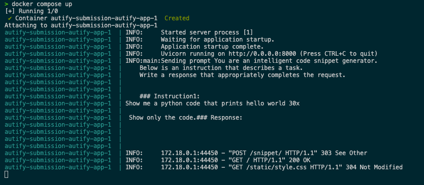
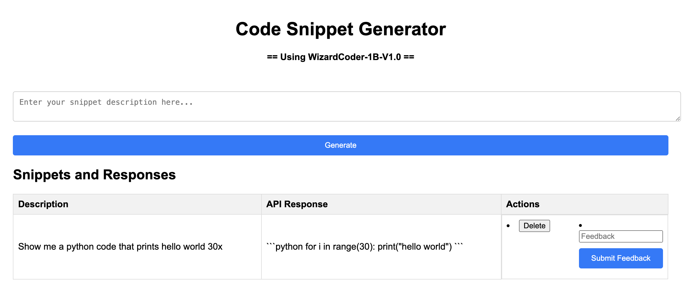
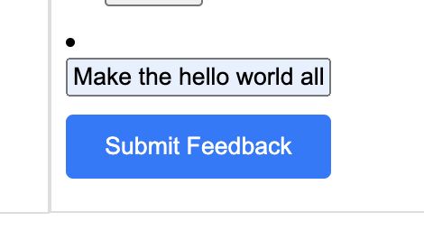
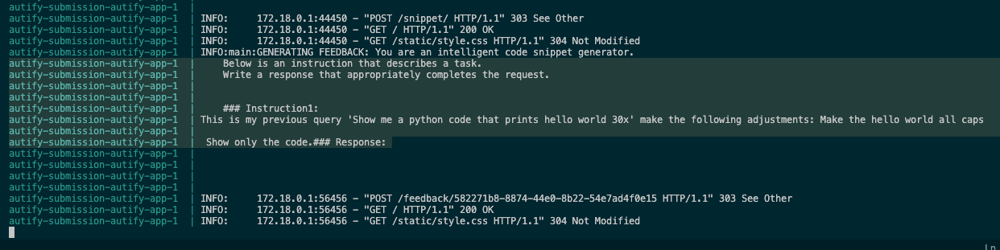
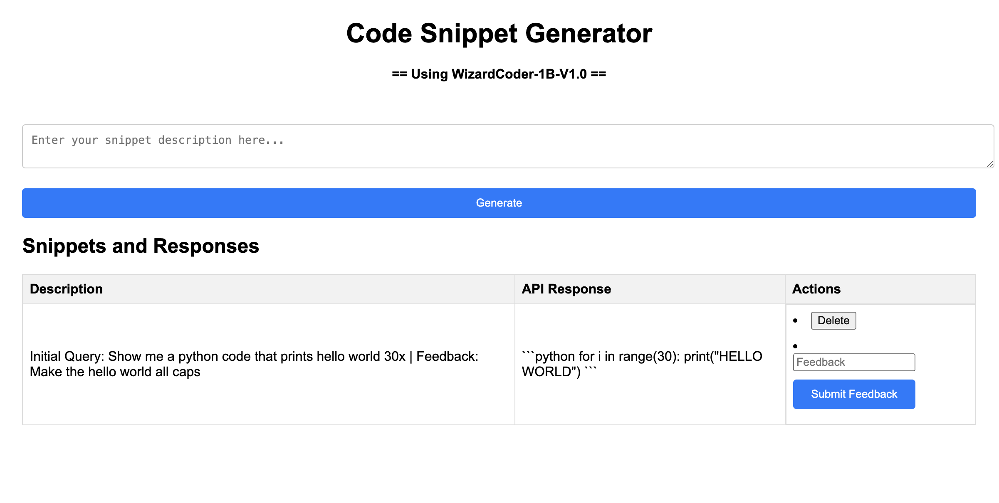

# autify-submission
This submission uses the huggingface api, particularly the smaller WizardCoderLM-1b as I've developed this locally. I initially tried loading model files locally but all of the LM i have tried is too big for my local set up and will take long for a small demonstration to provided respones, So I decided to just use the huggingface inferencing api for a serverless approach.

Not all requirements have been met as I ran out of time given the deadline, but I hope I have conveyed the general ideas that overall compasses applications leveraging LLMs.

## Walkthrough with the app

#### Building the image and running the app

#### Providing input query

#### Server logs showing generated prompt

#### Generated Code Snippet

#### Providing feedback on the response

#### Server logs showing new prompt for the added feedback

#### Generated Code Snippet showing old and new snippets with the refined response
